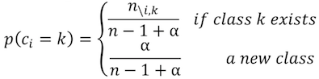

# DNA haplotype clustering with infinite Dirichlet process mixture model

Next generation sequencing (NGS) technology can produce more data in a single run compared to the traditional Sanger sequencing, while the sequence reads are shorter and have more error. If we need to sequence the DNA of a population, which are different among individuals, with traditional sequencing technology, we have to purify and amplify the DNA from each individual, then sequence them separately. But with NGS, we can sequence the mixed DNA sample directly, which is more efficient than the traditional way. However, when using NGS, typically the number of different DNA (referred to as haplotypes) is unknown, and more error will be introduced in, thus new data analysis method is in need.

When using NGS to sequence a mixed DNA sample, the data generated are amplified sequences with extra error. We are interested in how many haplotypes the reads can be clustered to and what are these haplotypes. A Dirichlet process mixture model, which can capture the uncertainty in the number of haplotypes, has been suggested to address this problem(Zagordi, Geyrhofer et al. 2010). The parameters in the model include the sequence of haplotypes, the assignment of each reads to haplotypes and error rate of sequencing process. 

In this model, I simplified the likelihood calculation for haplotypes by using binomial distribution instead of multinomial distribution, and relaxed the error rate by adding a Beta prior. 

## data simulation
- First, a master sequence was generated with the probability of 4 bases (A, T, C, G) at each position (0.25, 0.25, 0.25, 0.25). 
- Secondly, true haplotypes were generated according to the master sequence with similarity γ. This means for each position of a haplotype, it will have the same base as the master sequence with probability γ and have one of the other bases with probability (1- γ)/3 each. 
- Thirdly, a fixed number of reads were generated for each true haplotypes with similarity θ.

## Prior for cluster assignment
The Dirichlet process mixture (DPM) allows uncertainty in the number of clusters, which is ideal for our problem. The DPM introduce a prior on mixing proportions that leads to a few domination class and is controlled by hyper parameter α. The probability that read i is assigned to class k is :

 where 𝑛\i,krepresents the number of reads in class k except read i. In other words, the probability of assigning read i to class k is proportional to the number of reads already in class k, or with probability proportional to α, assign read i to a new class.
 
# Prior for γ and θ
Beta distribution was chosen as conjugate prior for both γ and θ.

γ ~ Beta(1,1)

θ ~ Beta(4,1)

a, b for Beta distribution of γ is set to 1, 1 as a non-informative prior since we do not have prior knowledge for γ. a, b for Beta distribution of θ is set to 4, 1 to represent our prior knowledge that the error in sequencing process is around 80%.

# Likelihood for cluster assignment
The likelihood of read i is assigned to haplotype k is considered as binomial. For a pair of read and haplotype, we count the number of match and mismatch between them. And the likelihood is :

θ^match(1-θ)mismatch

So for a set of reads r=(r_1,r_2,…,r_n )  , given assignment c=(c_1,c_2,…,c_k ), where clusters has haplotypes h=(h_1,h_2,…,h_k ), the likelihood is:

where n is the total number of reads, L is the length of reads, I is the indicator function.

# Likelihood for γ and θ
The likelihood of γ and θ given the reads, assignment and haplotypes is also considered as binomial. The likelihood for γ:

the likelihood for θ:

